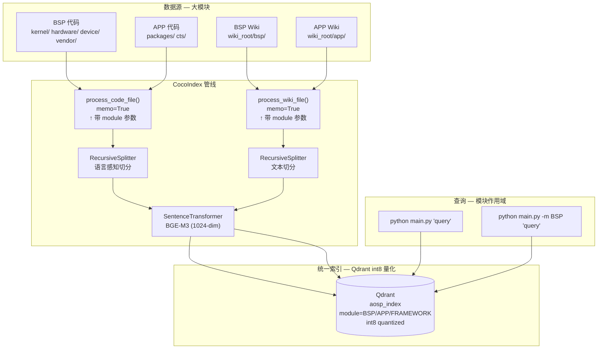

# AOSP Code + Wiki 统一学习 Pipeline

> 基于 CocoIndex 构建的代码 + 文档混合索引管线，用于 AOSP（Android Open Source Project）平台开发学习。
>
> 存储后端：**Qdrant**（int8 量化），嵌入模型：**BGE-M3**（中英双语 + 代码）

## 硬件要求

| 资源 | 要求 | 说明 |
|------|------|------|
| **GPU** | **必须** | BGE-M3 2.2GB，BSP 200 万 chunk 首次索引 GPU ~20min，CPU 8核 ~37h |
| 显存 | ≥ 4 GB | 模型加载 ~2.2GB，推理批次额外占用 |
| 内存 | ≥ 16 GB | Qdrant + Python 运行时 |
| 磁盘 | ≥ 50 GB | Qdrant int8 量化后 BSP 模块约 2GB，留足余量 |

> ⚠️ CPU 跑 BGE-M3 不是"慢一点"，是慢 100 倍。GPU 必须。

## 要解决的问题

在 AOSP 开发中，配置一个硬件功能（如 LCD MIPI、GPIO、充电 IC）需要跨越 **4 个代码层**：

```
DTS (设备树)  →  Kernel 驱动 (C)  →  HAL (C++)  →  Framework (Java)
```

同时还有 **Wiki / 文档**（芯片 datasheet 摘录、bringup 笔记、内部 wiki）描述这些配置的意图和方法。

### 学习模式：按大模块划分

AOSP 学习不是按目录学的，而是按**大模块**：

```
今天学 BSP（板级支持包）
    ├── kernel/      （所有驱动）
    ├── hardware/    （HAL 层）
    ├── device/      （DTS、vendor 配置）
    └── vendor/      （私有 blob 配置）

明天学 APP（应用层）
    ├── packages/    （Settings、Launcher）
    └── cts/         （兼容性测试）
```

每个大模块的代码**物理上分散在几十个目录**中，无法用一个 `code_dir` 路径圈定。

### 传统关键词搜索的痛点

- 搜 "MIPI" 找不到 `dsi_lp11_before_reset`（不同命名风格）
- 搜 "充电" 找不到 `bq27541_fg_probe`（中文 vs 英文字段名）
- 代码实现的**意图**和文档描述的**概念**之间存在语义鸿沟
- 搜 BSP 驱动结果里混入了 APP 代码，无法按模块过滤

## 设计思路

### 核心策略一：统一向量空间

代码和文档的 chunk **嵌入到同一个向量空间** 中，存在同一张 LanceDB 表：

```
search("MIPI DSI lane config")  或  search("MIPI DSI" --module BSP)
        │
        ▼
┌─────────────────────────────────────────────────────────┐
│                 LanceDB (aosp_index)                     │
│                                                          │
│  📄 [BSP] dsi_host.c:320         0.87  ← 驱动实现       │
│  📖 [BSP] display/mipi.md         0.82  ← BSP Wiki      │
│  📄 [BSP] panel-dtsi:42           0.78  ← DTS 配置      │
│  📖 [BSP] power/pmic.md           0.71  ← 相关电源       │
│  📄 [BSP] dsi_phy.c:105           0.68  ← PHY 配置      │
│  ← 注意：APP 模块的结果不会出现                           │
└─────────────────────────────────────────────────────────┘
```

每个 chunk 打上 **模块标签**（`module` 字段），搜索时可以用 `--module BSP` 过滤，保证今天学 BSP 时不会被 APP 代码干扰。

### 核心策略二：Glob 驱动的模块匹配

模块不是靠目录划分，而是靠 **glob 模式匹配**。在 `models.py` 中定义：

```python
MODULES = [
    ModuleConfig(
        name="BSP",
        code_globs=["**/kernel/**", "**/hardware/**", "**/device/**", "**/vendor/**"],
        wiki_dir="bsp",
    ),
    ModuleConfig(
        name="APP",
        code_globs=["**/packages/**", "**/cts/**"],
        wiki_dir="app",
    ),
]
```

一个文件可能匹配多个模块（如 `kernel/` 同时被 BSP 和 KERNEL 模块覆盖），**第一个匹配的模块获胜**。

### 核心策略三：按模块控制索引范围

```bash
# 这周学 BSP，只索引 BSP（跳过 APP/FRAMEWORK）
COCOINDEX_MODULES=BSP cocoindex update main

# 下周学 APP，切过去
COCOINDEX_MODULES=APP cocoindex update main

# 不设环境变量 = 索引全部
cocoindex update main
```

每个模块的 Wiki 也存储在 `wiki_root/{module_name}/` 子目录下，互不干扰。

### 为什么用 Qdrant 而不是 LanceDB

虽然 LanceDB 嵌入式部署更方便，但 AOSP 大模块的规模决定了从一开始就该用 Qdrant：

| | LanceDB | **Qdrant（本方案）** |
|---|---|---|
| **单机上限** | ~5 千万向量 | ~10 亿向量 |
| **量化压缩** | ❌ 不支持 int8 | ✅ int8 压缩 4x，精度损失 <0.5% |
| **payload 过滤** | ⚠️ 有限 | ✅ 原生的 module 字段过滤 |
| **部署** | 零部署（文件即数据库） | `docker run qdrant/qdrant` 一条命令 |
| **生产就绪** | ⚠️ 不适合大规模 | ✅ 企业级，gRPC + 水平扩展 |

**核心原因**：BSP 一个模块就是 5GB 源码，200 万 chunk——Qdrant int8 量化后只需 1.9 GB，性能稳定。等学完 BSP 再学 APP，两个模块加起来 600 万 chunk，Qdrant 依然轻松。未来做成企业级产品也不用换存储。

> 💡 如果只是想快速体验，LanceDB 仍然可用——改回 `lancedb` 只需换 import 和 3 行代码。

### 为什么 LLM 提取是可选的

设计上考虑了两条路径：

| | 纯向量搜索（LLM_MODEL 不设） | LLM 增强（LLM_MODEL 设置） |
|---|---|---|
| **能搜到什么** | 语义相似的代码/Wiki 片段 | 同上 + LLM 提取的实体/概念结构化信息 |
| **成本** | 免费（本地 embedding） | LLM API 调用费用 |
| **适用场景** | 快速上手、本地离线 | 深入分析、建立结构化知识图谱 |

LLM 提取 prompt 针对 **硬件使能场景** 定制：重点提取显示/电源/GPIO/音频/传感器相关的实体和概念。

### 为什么选 BGE-M3 而不是 all-MiniLM-L6-v2

`all-MiniLM-L6-v2` 是最常见的入门模型，但对 AOSP + 中文 Wiki 场景**完全不适合**：

| | all-MiniLM-L6-v2 | BGE-M3 |
|---|---|---|
| **中文支持** | ❌ 不支持，tokenizer 不认识中文字 | ✅ 原生支持 100+ 语言 |
| **代码文本** | ⚠️ 勉强可用 | ✅ 训练数据含多语言代码 |
| **向量维度** | 384-dim | 1024-dim（精度更高） |
| **检索方式** | 仅稠密向量 | 稠密 + 稀疏（hybrid） |
| **模型大小** | ~80 MB | ~2.2 GB |
| **MTEB 中文榜** | 未上榜 | 🥇 领先 |

**我们的 Wiki 是中文**，代码注释也常是中英混合。用 all-MiniLM-L6-v2 搜中文会被切成乱码，语义搜索直接废掉。BGE-M3 是当前中英混合场景的最优选择。

如果显存紧张，备选：

| 模型 | 维度 | 大小 | 中文 | 代码 | 适用场景 |
|------|------|------|------|------|----------|
| `BAAI/bge-m3` | 1024 | 2.2 GB | ✅ | ✅ | **推荐**，混合场景最优 |
| `BAAI/bge-large-zh-v1.5` | 1024 | 1.3 GB | ✅ | ⚠️ | 中文为主，英文次之 |
| `BAAI/bge-small-zh-v1.5` | 512 | 96 MB | ✅ | ⚠️ | 显存紧张时的轻量选择 |
| `intfloat/multilingual-e5-large` | 1024 | 2.2 GB | ✅ | ✅ | 多语言均衡 |

### 为什么不用 Jina Code / Jina ZH

Jina 的模型很好，但存在一个关键限制：**中文和代码是拆成两个模型的**。

| Jina 模型 | 中文查询 | 代码检索 | 能同时用？ |
|-----------|----------|----------|-----------|
| `jina-embeddings-v2-base-code` | ❌ 仅支持英文查询 | ✅ 30 种编程语言 | ❌ |
| `jina-embeddings-v2-base-zh` | ✅ 中英双语 | ⚠️ 通用文本，未针对代码训练 | ❌ |
| `jina-embeddings-v3` | ✅ 多语言 | ✅ | ✅ 但 570M 参数，更重 |

我们的场景必须**同时处理中文 Wiki 查询和 C/Java/DTS 代码**——"搜 MIPI DSI lane config"这句查询本身就是中英混合。如果拆成两个模型，要么牺牲中文精度，要么牺牲代码精度，要么跑两遍合并结果。BGE-M3 一个模型全搞定，没有这个取舍问题。

> Jina embeddings v3/v4 也开始支持多语言+代码了，但 BGE-M3 在 MTEB 中文 + 代码 benchmark 上实战验证更充分，社区报告也更稳定。

### 为什么两路分开处理

代码和 Wiki 虽然最终进同一张表，但**处理逻辑完全不同**：

```
                  代码路径                         Wiki 路径
─────────────────────────────────────────────────────────────
切分策略    RecursiveSplitter(language=c)    RecursiveSplitter(language=None)
             按函数/结构体边界切分             按段落/标题边界切分
语言感知    tree-sitter AST 解析             纯文本
元数据      title=函数名/DTS节点名           title=文件名
LLM提示    提取硬件相关代码实体              提取概念+代码引用关系
```

分开处理的好处：以后要加新语言（比如 `.rs` Rust 驱动）只改代码路径；要加新文档格式（比如 `.adoc`）只改 Wiki 路径。

## 架构图



## 数据流详解

### 代码路径

```
walk_dir(code_dir, *.c/*.h/*.dts/*.java)
    │
    ├─ 文件未变更 → memo=True 跳过（增量更新核心）
    │
    └─ 文件变更/新增:
        │
        ├─ read_text()
        ├─ _guess_language() → "c" / "dts" / "java" / None
        ├─ RecursiveSplitter.split(language=...)
        │     ├─ tree-sitter 解析 AST
        │     └─ 按函数/结构体/DTS 节点边界切分 chunks
        │
        ├─ 每个 chunk:
        │     ├─ IdGenerator.next_id() → 稳定 hash
        │     ├─ EMBEDDER.embed() → 1024维向量（BGE-M3）
        │     └─ table.declare_row(UnifiedChunk)
        │
        └─ (可选) LLM 提取 CodeEntity 列表
              └─ 存入 chunk_type="code" 的 metadata
```

### Wiki 路径

```
walk_dir(wiki_dir, *.md/*.rst/*.txt)
    │
    ├─ 文件未变更 → memo=True 跳过
    │
    └─ 文件变更/新增:
        │
        ├─ read_text()
        ├─ RecursiveSplitter.split(language=None)
        │     └─ 按段落/标题边界切分（不感知语言）
        │
        ├─ 每个 chunk:
        │     ├─ EMBEDDER.embed() → 1024维向量（BGE-M3）
        │     └─ table.declare_row(UnifiedChunk)
        │
        └─ (可选) LLM 提取 WikiConcept 列表
              ├─ 每个概念带 code_references: ["drivers/gpu/drm/msm/dsi/"]
              └─ 存入 chunk_type="wiki" 的 metadata
```

## 增量更新机制

CocoIndex 的引擎核心能力：

```
文件A 修改 → 只有 process_code_file(file=A) 重新执行
               → 旧的 A 的 chunks 自动删除
               → 新的 A 的 chunks 写入
               → B、C、D 不受影响

Wiki 新增 → 只有 process_wiki_file(file=新wiki) 执行
             → 新 chunks 追加到 LanceDB

文件删除 → 对应的 chunks 自动清理
```

配合 `cocoindex update -L`（live 模式），文件系统变更 1 秒内触发重处理。

## 文件结构

```
examples/aosp_learning/
├── main.py           # Pipeline 主体 + 搜索脚本（支持 -m 模块过滤）
├── models.py         # 数据模型 + ModuleConfig + MODULES 预定义
├── pyproject.toml    # 依赖声明
├── .env.example      # LLM_MODEL 等环境变量模板
└── README.md         # 本文档
```

## 如何适配自己的 AOSP 场景

### 1. 定义你的大模块

编辑 `models.py` 中的 `MODULES` 列表。每个模块用 glob 圈定代码范围：

```python
MODULES = [
    ModuleConfig(
        name="BSP",
        code_globs=["**/kernel/**", "**/hardware/**", "**/device/**", "**/vendor/**"],
        wiki_dir="bsp",              # wiki_root/bsp/ 下的文档属于 BSP
        description="板级支持包",
    ),
    # 可以自由增加：AUDIO、CAMERA、MODEM 等你自己的划分方式
]
```

### 2. 指向你的代码和 Wiki 根目录

编辑 `main.py` 底部：

```python
app = coco.App(
    coco.AppConfig(name="AospCodeWikiLearning"),
    app_main,
    aosp_root=pathlib.Path("/your/aosp"),         # ← AOSP 源码根
    wiki_root=pathlib.Path("/your/wiki"),          # ← Wiki 根（含 bsp/ app/ 子目录）
)
```

Wiki 目录约定：

```
wiki_root/
├── bsp/          ← BSP 模块的文档（bringup 笔记、datasheet 摘录）
├── framework/    ← Framework 层文档
└── app/          ← 应用层文档
```

### 3. 日常使用流程

```bash
# ① 启动 Qdrant（首次或重启后）
docker run -d -p 6333:6333 -p 6334:6334 qdrant/qdrant

# ② 今天学 BSP — 只索引 BSP 模块
COCOINDEX_MODULES=BSP cocoindex update main

# ③ 搜索时限定 BSP 范围
python main.py -m BSP "mipi dsi 初始化时序"
python main.py -m BSP "gpio 中断配置"

# ④ 明天学 APP — 增量索引 APP（Qdrant int8 压缩后 BSP 只占 1.9 GB）
COCOINDEX_MODULES=APP cocoindex update main
python main.py -m APP "activity 启动流程"

# ⑤ 跨模块搜索
python main.py "亮度调节 backlight"
```

**关键优势**：学完 BSP 再学 APP 时，BSP 的索引已经存在，跨模块搜索（如“背光调节从 App 到驱动的全链路”）立刻可用。

### 4. 加新语言支持

在 `main.py` 的 `_CODE_LANGUAGES` 里加一行：

```python
_CODE_LANGUAGES = {
    ".rs": "rust",     # ← Rust 驱动
    ".go": "go",       # ← Go 工具
    # ... 已有项
}
```

### 5. 换向量库

将 `lancedb` 换成 `qdrant` 或 `postgres`：

```python
# from cocoindex.connectors import qdrant
# 只需改 import 和 mount_table_target() 调用
```

## 存储选型与扩展

AOSP 源码量巨大（全量 50-100GB），但**实际学习时按大模块索引**，不会一次性索引全量。不同模块规模对应不同存储方案。

### 数据量估算

以每个 chunk 约 500 token、BGE-M3 1024 维 float32（4KB/向量）计算：

| 场景 | 源码量 | Chunk 数 | float32 原始 | int8 量化 (4x) | 二值量化 (32x) |
|------|--------|----------|-------------|---------------|---------------|
| **BSP 大模块** | 5 GB | 200 万 | 7.6 GB | **1.9 GB** | 0.2 GB |
| **BSP + Framework** | 15 GB | 600 万 | 22.9 GB | **5.7 GB** | 0.7 GB |
| **全量 AOSP** | 80 GB | 3200 万 | 122 GB | **30.5 GB** | 3.8 GB |

> 🔑 **关键结论**：BGE-M3 + int8 量化后（1.9 GB），比 all-MiniLM-L6-v2 float32（2.9 GB）**体积更小、中文精度更高**。完全不用担心。
>
> 二值量化（0.2 GB）几乎白送，精度损失 <3%，代码搜索场景基本无感。

### 按需切换存储后端（或回退到 LanceDB）

Qdrant 是本方案的默认选择，但如果想快速体验（不需要装 Docker），可以切回 LanceDB：

```python
# main.py 改动 — 从 Qdrant 切回 LanceDB

# 1. import
# from cocoindex.connectors import qdrant
from cocoindex.connectors import lancedb

# 2. ContextKey
# QDRANT_DB = coco.ContextKey[QdrantClient]("qdrant")
LANCE_DB = coco.ContextKey[lancedb.LanceAsyncConnection]("lancedb")

# 3. mount
# target = await qdrant.mount_collection_target(...)
target = await lancedb.mount_table_target(...)
```

其他向量库（Postgres+pgvector、Milvus）也是同样的模式，CocoIndex 的 connector 抽象层保证了管线逻辑不变。

**Qdrant 量化配置**（解决 BGE-M3 向量体积问题）：

```python
# 创建 collection 时开启 int8 量化，体积缩减 4x，精度损失 <0.5%
client.create_collection(
    collection_name="aosp_index",
    vectors_config={"size": 1024, "distance": "Cosine",
                     "quantization_config": {"scalar": {"type": "int8", "always_ram": True}}},
)

# 如果体积仍然敏感，用二值量化（32x 压缩，损失 <3%）
# "quantization_config": {"binary": {"always_ram": True}}
```

### 矢量库选择速查

| 方案 | 单机上限 | 部署成本 | 适用规模 |
|------|----------|----------|----------|
| **Qdrant（本方案）** | ~10 亿向量 | `docker run qdrant/qdrant` | 单个大模块 → 全量 AOSP |
| **Postgres + pgvector** | ~10 亿向量 | `docker run pgvector/pgvector` | 已有 PG 时首选 |
| **Milvus** | 百亿级向量 | 多容器 | 生产级全量 |
| **LanceDB** | ~5 千万向量 | 零部署 | 快速体验（无需 Docker） |

**建议路径**：直接用 Qdrant（企业级，一条 docker 命令即可）。只想体验不需要装 Docker → LanceDB。

## 与现有工具的关系

| | 本 Pipeline | codebase-memory-mcp | cs.android.com | OpenGrok |
|---|---|---|---|---|
| **离线可用** | ✅ 离线 + Docker | ✅ | ❌ | ✅ |
| **增量更新** | ✅ 按文件粒度 | ❌ 需手动重索引 | N/A | ❌ 需全量重建 |
| **语义搜索** | ✅ embedding + int8 量化 | ✅ embedding | ❌ | ❌ |
| **代码+文档混合** | ✅ 统一向量空间 | ❌ 仅代码 | ❌ | ❌ |
| **大模块作用域** | ✅ module 字段 + glob | ❌ | ❌ | ❌ |
| **按模块选择性索引** | ✅ COCOINDEX_MODULES=BSP | ❌ | N/A | ❌ |
| **LLM 定制** | ✅ 完全可控 prompt | ❌ | ❌ | ❌ |
| **企业级扩展** | ✅ Qdrant 水平扩展 | ❌ | N/A | ❌ |
| **上手成本** | 中（需 Python + Docker） | 低 | 最低 | 中 |

与其他工具**不是替代关系，而是互补**：先用 `cs.android.com` 理解大体架构，用 `codebase-memory-mcp` 做调用链追踪，用本 pipeline 做持续的语义搜索和增量索引。

## 依赖与技术栈

| 组件 | 用途 | 类型 |
|------|------|------|
| CocoIndex | 管线引擎（增量、memo、声明式 API） | 框架 |
| Qdrant | 向量存储 + int8 量化（gRPC） | 存储 |
| BGE-M3 | 1024-dim 中英双语 + 代码嵌入 | ML |
| tree-sitter (RecursiveSplitter) | 代码 AST 感知切分 | 解析 |
| LiteLLM + instructor | 可选 LLM 结构提取 | AI |
| PyO3 / Rust core | 引擎性能关键路径 | 性能 |
