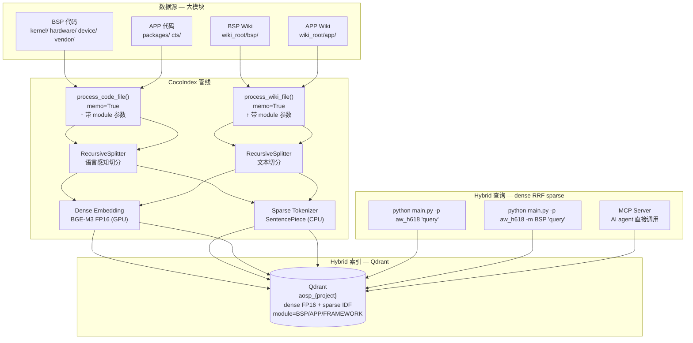

# AOSP Code + Wiki 统一学习 Pipeline

> 基于 CocoIndex 构建的代码 + 文档混合索引管线，用于 AOSP（Android Open Source Project）平台开发学习。
>
> 存储后端：**Qdrant**（FP16），嵌入模型：**BGE-M3**（中英双语 + 代码，FP16 推理）

## 硬件要求

| 资源 | 要求 | 说明 |
|------|------|------|
| **GPU** | **必须** | BGE-M3 FP16 推理 ~1.1GB 显存，BSP 200 万 chunk 首次索引 GPU ~12min，CPU 8核 ~37h |
| 显存 | ≥ 4 GB | 模型 FP16 加载 ~1.1GB，推理批次额外占用 |
| 内存 | ≥ 16 GB | Qdrant + Python 运行时 |
| 磁盘 | ≥ 50 GB | Qdrant FP16 存储 BSP 模块约 4GB，留足余量 |

> ⚠️ CPU 跑 BGE-M3 不是"慢一点"，是慢 100 倍。GPU 必须。

## 要解决的问题

在 AOSP 开发中，配置一个硬件功能（如 LCD MIPI、GPIO、充电 IC）需要跨越 **4 个代码层**：

```
DTS (设备树)  →  Kernel 驱动 (C)  →  HAL (C++)  →  Framework (Java)
```

同时还有 **Wiki / 文档**（芯片 datasheet 摘录、bringup 笔记、内部 wiki）描述这些配置的意图和方法。

### 学习模式：按大模块划分

AOSP 学习不是按目录学的，而是按**大模块**：

```
今天学 BSP（板级支持包）
    ├── kernel/      （所有驱动）
    ├── hardware/    （HAL 层）
    ├── device/      （DTS、vendor 配置）
    └── vendor/      （私有 blob 配置）

明天学 APP（应用层）
    ├── packages/    （Settings、Launcher）
    └── cts/         （兼容性测试）
```

每个大模块的代码**物理上分散在几十个目录**中，无法用一个 `code_dir` 路径圈定。

### 传统关键词搜索的痛点

- 搜 "MIPI" 找不到 `dsi_lp11_before_reset`（不同命名风格）
- 搜 "充电" 找不到 `bq27541_fg_probe`（中文 vs 英文字段名）
- 代码实现的**意图**和文档描述的**概念**之间存在语义鸿沟
- 搜 BSP 驱动结果里混入了 APP 代码，无法按模块过滤

## 设计思路

### 核心策略一：统一向量空间

代码和文档的 chunk **嵌入到同一个向量空间** 中，存在同一张 Qdrant collection（每个项目一张，见策略四）：

```
search("MIPI DSI lane config")  或  search("MIPI DSI" --module BSP)
        │
        ▼
┌─────────────────────────────────────────────────────────┐
│                 Qdrant (aosp_aw_h618)                    │
│                                                          │
│  📄 [BSP] dsi_host.c:320         0.87  ← 驱动实现       │
│  📖 [BSP] display/mipi.md         0.82  ← BSP Wiki      │
│  📄 [BSP] panel-dtsi:42           0.78  ← DTS 配置      │
│  📖 [BSP] power/pmic.md           0.71  ← 相关电源       │
│  📄 [BSP] dsi_phy.c:105           0.68  ← PHY 配置      │
│  ← 注意：APP 模块的结果不会出现                           │
└─────────────────────────────────────────────────────────┘
```

每个 chunk 打上 **模块标签**（`module` 字段），搜索时可以用 `--module BSP` 过滤，保证今天学 BSP 时不会被 APP 代码干扰。

### 核心策略二：Glob 驱动的模块匹配

模块不是靠目录划分，而是靠 **glob 模式匹配**。在 `models.py` 中定义：

```python
MODULES = [
    ModuleConfig(
        name="BSP",
        code_globs=["**/kernel/**", "**/hardware/**", "**/device/**", "**/vendor/**"],
        wiki_dir="bsp",
    ),
    ModuleConfig(
        name="APP",
        code_globs=["**/packages/**", "**/cts/**"],
        wiki_dir="app",
    ),
]
```

一个文件可能匹配多个模块（如 `kernel/` 同时被 BSP 和 KERNEL 模块覆盖），**第一个匹配的模块获胜**。

### 核心策略三：按模块控制索引范围

```bash
# 这周学 BSP，只索引 BSP（跳过 APP/FRAMEWORK）
COCOINDEX_MODULES=BSP cocoindex update main:aw_h618

# 下周学 APP — 注意要累加写成 BSP,APP！
# CocoIndex 是声明式的：本次运行没声明的模块会被视为"已删除"，
# 只写 APP 会把已建好的 BSP 索引从 Qdrant 中清掉
COCOINDEX_MODULES=BSP,APP cocoindex update main:aw_h618

# 不设环境变量 = 索引全部
cocoindex update main:aw_h618
```

每个模块的 Wiki 也存储在 `wiki_root/{module_name}/` 子目录下，互不干扰。

### 核心策略四：多项目隔离（按芯片/厂商分表）

不同芯片（H618 → H619）、甚至同名芯片不同厂商（全志 H618 vs MTK H618），代码完全不同，必须彻底隔离：

```
项目            Qdrant collection    CocoIndex checkpoint
──────────────────────────────────────────────────────────
全志 H618       aosp_aw_h618         App "aw_h618"
MTK  H618       aosp_mtk_h618        App "mtk_h618"
全志 H619       aosp_aw_h619         App "aw_h619"
```

三层隔离：

1. **Qdrant 分 collection**：每个项目一张表（`aosp_{project}`），搜索互不串台，删项目直接删表
2. **CocoIndex 分 checkpoint**：每个 App 名独立增量状态，重建 A 项目不影响 B
3. **payload 带 project 字段**：冗余标记，未来如需跨项目对比分析也有据可查

新项目接入只需在 `main.py` 底部照抄一个 App 定义：

```python
mtk_h618 = coco.App(
    coco.AppConfig(name="mtk_h618"),
    app_main,
    aosp_root=pathlib.Path("/path/to/mtk-h618-source"),
    wiki_root=pathlib.Path("./aosp_wiki_mtk"),
    project="mtk_h618",
)
```

```bash
cocoindex update main:mtk_h618              # 索引 MTK 项目
python main.py -p mtk_h618 "gpio 配置"      # 只搜 MTK 项目
```

### 为什么用 Qdrant 而不是 LanceDB

虽然 LanceDB 嵌入式部署更方便，但 AOSP 大模块的规模决定了从一开始就该用 Qdrant：

| | LanceDB | **Qdrant（本方案）** |
|---|---|---|
| **单机上限** | ~5 千万向量 | ~10 亿向量 |
| **FP16 精度** | ❌ 不支持 | ✅ 推理+存储全链路 FP16，无损 |
| **Hybrid Search** | ⚠️ FTS 有限 | ✅ Dense + Sparse IDF + RRF Fusion |
| **payload 过滤** | ⚠️ 有限 | ✅ 原生的 module 字段过滤 |
| **部署** | 零部署（文件即数据库） | `docker run qdrant/qdrant` 一条命令 |
| **生产就绪** | ⚠️ 不适合大规模 | ✅ 企业级，gRPC + 水平扩展 |

**核心原因**：BSP 一个模块就是 5GB 源码，200 万 chunk。Qdrant FP16 存储只需 3.8 GB，性能稳定。推理和存储全链路 FP16，精度无损。原生支持 `modifier="idf"` 实现 hybrid search（dense 语义 + sparse 关键词），无额外 GPU 开销。等学完 BSP 再学 APP，两个模块加起来 600 万 chunk，Qdrant 依然轻松。未来做成企业级产品也不用换存储。

> 💡 如果只是想快速体验，LanceDB 仍然可用——改回 `lancedb` 只需换 import 和 3 行代码。

### 为什么 LLM 提取是可选的

设计上考虑了两条路径：

| | 纯向量搜索（LLM_MODEL 不设） | LLM 增强（LLM_MODEL 设置） |
|---|---|---|
| **能搜到什么** | 语义相似的代码/Wiki 片段 | 同上 + LLM 提取的实体/概念结构化信息 |
| **成本** | 免费（本地 embedding） | LLM API 调用费用 |
| **适用场景** | 快速上手、本地离线 | 深入分析、建立结构化知识图谱 |

LLM 提取 prompt 针对 **硬件使能场景** 定制：重点提取显示/电源/GPIO/音频/传感器相关的实体和概念。

### 为什么选 BGE-M3 而不是 all-MiniLM-L6-v2

`all-MiniLM-L6-v2` 是最常见的入门模型，但对 AOSP + 中文 Wiki 场景**完全不适合**：

| | all-MiniLM-L6-v2 | BGE-M3 |
|---|---|---|
| **中文支持** | ❌ 不支持，tokenizer 不认识中文字 | ✅ 原生支持 100+ 语言 |
| **代码文本** | ⚠️ 勉强可用 | ✅ 训练数据含多语言代码 |
| **向量维度** | 384-dim | 1024-dim（精度更高） |
| **检索方式** | 仅稠密向量 | 稠密 + 稀疏（hybrid） |
| **模型大小** | ~80 MB | ~2.2 GB |
| **MTEB 中文榜** | 未上榜 | 🥇 领先 |

**我们的 Wiki 是中文**，代码注释也常是中英混合。用 all-MiniLM-L6-v2 搜中文会被切成乱码，语义搜索直接废掉。BGE-M3 是当前中英混合场景的最优选择。

如果显存紧张，备选：

| 模型 | 维度 | 大小 | 中文 | 代码 | 适用场景 |
|------|------|------|------|------|----------|
| `BAAI/bge-m3` | 1024 | 2.2 GB | ✅ | ✅ | **推荐**，混合场景最优 |
| `BAAI/bge-large-zh-v1.5` | 1024 | 1.3 GB | ✅ | ⚠️ | 中文为主，英文次之 |
| `BAAI/bge-small-zh-v1.5` | 512 | 96 MB | ✅ | ⚠️ | 显存紧张时的轻量选择 |
| `intfloat/multilingual-e5-large` | 1024 | 2.2 GB | ✅ | ✅ | 多语言均衡 |

### 为什么不用 Jina Code / Jina ZH

Jina 的模型很好，但存在一个关键限制：**中文和代码是拆成两个模型的**。

| Jina 模型 | 中文查询 | 代码检索 | 能同时用？ |
|-----------|----------|----------|-----------|
| `jina-embeddings-v2-base-code` | ❌ 仅支持英文查询 | ✅ 30 种编程语言 | ❌ |
| `jina-embeddings-v2-base-zh` | ✅ 中英双语 | ⚠️ 通用文本，未针对代码训练 | ❌ |
| `jina-embeddings-v3` | ✅ 多语言 | ✅ | ✅ 但 570M 参数，更重 |

我们的场景必须**同时处理中文 Wiki 查询和 C/Java/DTS 代码**——"搜 MIPI DSI lane config"这句查询本身就是中英混合。如果拆成两个模型，要么牺牲中文精度，要么牺牲代码精度，要么跑两遍合并结果。BGE-M3 一个模型全搞定，没有这个取舍问题。

> Jina embeddings v3/v4 也开始支持多语言+代码了，但 BGE-M3 在 MTEB 中文 + 代码 benchmark 上实战验证更充分，社区报告也更稳定。

### 为什么两路分开处理

代码和 Wiki 虽然最终进同一张表，但**处理逻辑完全不同**：

```
                  代码路径                         Wiki 路径
─────────────────────────────────────────────────────────────
切分策略    RecursiveSplitter(language=c)    RecursiveSplitter(language=None)
             按函数/结构体边界切分             按段落/标题边界切分
语言感知    tree-sitter AST 解析             纯文本
元数据      title=函数名/DTS节点名           title=文件名
LLM提示    提取硬件相关代码实体              提取概念+代码引用关系
```

分开处理的好处：以后要加新语言（比如 `.rs` Rust 驱动）只改代码路径；要加新文档格式（比如 `.adoc`）只改 Wiki 路径。

## 架构图



## 数据流详解

### 代码路径

```
walk_dir(code_dir, *.c/*.h/*.dts/*.java)
    │
    ├─ 文件未变更 → memo=True 跳过（增量更新核心）
    │
    └─ 文件变更/新增:
        │
        ├─ read_text()
        ├─ _guess_language() → "c" / "dts" / "java" / None
        ├─ RecursiveSplitter.split(language=...)
        │     ├─ tree-sitter 解析 AST
        │     └─ 按函数/结构体/DTS 节点边界切分 chunks
        │
        ├─ 每个 chunk:
        │     ├─ IdGenerator.next_id() → 稳定 hash
        │     ├─ EMBEDDER.embed() → 1024维 dense 向量（BGE-M3 FP16，GPU batched）
        │     ├─ SPARSE_TOKENIZER.tokenize() → token IDs（SentencePiece，CPU）
        │     └─ target.declare_point({dense: embedding, sparse: SparseVector(ids, [1.0]*n)})
        │
        └─ (可选) LLM 提取 CodeEntity 列表
              └─ 存入 chunk_type="code" 的 metadata
```

### Wiki 路径

```
walk_dir(wiki_dir, *.md/*.rst/*.txt)
    │
    ├─ 文件未变更 → memo=True 跳过
    │
    └─ 文件变更/新增:
        │
        ├─ read_text()
        ├─ RecursiveSplitter.split(language=None)
        │     └─ 按段落/标题边界切分（不感知语言）
        │
        ├─ 每个 chunk:
        │     ├─ EMBEDDER.embed() → 1024维 dense 向量（BGE-M3 FP16）
        │     ├─ SPARSE_TOKENIZER.tokenize() → token IDs（CPU）
        │     └─ target.declare_point({dense: embedding, sparse: SparseVector(ids, [1.0]*n)})
        │
        └─ (可选) LLM 提取 WikiConcept 列表
              ├─ 每个概念带 code_references: ["drivers/gpu/drm/msm/dsi/"]
              └─ 存入 chunk_type="wiki" 的 metadata
```

## 增量更新机制

增量是默认行为——**重跑一次 `cocoindex update main:aw_h618` 就是增量更新**，无需任何额外参数。CocoIndex 的引擎核心能力：

```
文件A 修改 → 只有 process_code_file(file=A) 重新执行
               → 旧的 A 的 chunks 自动删除
               → 新的 A 的 chunks 写入
               → B、C、D 不受影响

Wiki 新增 → 只有 process_wiki_file(file=新wiki) 执行
             → 新 chunks 追加到 Qdrant

文件删除 → 对应的 chunks 自动清理
```

三层判断（从粗到细）：

1. **组件路径 diff**：每个文件一个 mount 路径，新增→处理、消失→清理向量、不变→进入下层
2. **memo 缓存**：文件内容、函数代码、`detect_change=True` 的 context（embedding 模型配置、LLM_MODEL）都没变 → 跳过，不跑 GPU
3. **目标状态 diff**：即使重算，declare 的 points 与上次比对，只有变化的点才写 Qdrant

配合 `cocoindex update -L`（live 模式），文件系统变更 1 秒内触发重处理。

### 为什么 `COCOINDEX_MODULES` 会删数据？

CocoIndex 是**声明式引擎**——你只声明“本次要处理哪些模块”，引擎负责把实际状态同步成你声明的样子：

```
第一次：COCOINDEX_MODULES=BSP    → 索引 BSP，Qdrant 里有 BSP 的 16 万向量
第二次：COCOINDEX_MODULES=APP    → 引擎发现“BSP 没被声明”
                                  → 认为“BSP 已被移除”
                                  → 自动删除 BSP 的全部向量 ❌
```

这和 `rm` 删文件不同——**没有任何确认提示**，引擎默认就是“声明了什么就只留什么”。

### 安全护栏：`_guard_module_removal()`

管线在启动时（`app_main` 开头）会先查 Qdrant，检查已索引模块是否都在本次 `COCOINDEX_MODULES` 中：

```
Qdrant 中 BSP 有 161034 chunks
本次 COCOINDEX_MODULES=APP（没有 BSP）
→ guard 检测到 BSP 有数据但未声明
→ RuntimeError，拒绝运行，BSP 的向量不动
```

实际报错：
```
RuntimeError: 已索引模块未在本次 COCOINDEX_MODULES 中声明: BSP (161034 chunks)。
继续运行会删除这些模块的全部向量！
请累加声明（COCOINDEX_MODULES=APP,BSP），
或不设环境变量索引全部；确认要删除请设 COCOINDEX_ALLOW_MODULE_REMOVAL=1。
```

### 正确的增量操作

```bash
# ① 第一天：索引 BSP
COCOINDEX_MODULES=BSP cocoindex update main:aw_h618

# ② 第二天：加 APP — 累加写 BSP,APP（BSP 的向量不受影响，只增量处理 APP 的文件）
COCOINDEX_MODULES=BSP,APP cocoindex update main:aw_h618

# ③ 第三天：又加 FRAMEWORK — 继续累加
COCOINDEX_MODULES=BSP,APP,FRAMEWORK cocoindex update main:aw_h618

# ④ 或者干脆不设环境变量，索引全部模块
#    （不加 COCOINDEX_MODULES 就等于“声明全部”，不会触发 guard）
cocoindex update main:aw_h618
```

### 什么时候 guard 不拦？

| 场景 | guard 行为 | 说明 |
|------|-----------|------|
| 首次索引，Qdrant 为空 | 跳过 | 没有数据需要保护 |
| `COCOINDEX_MODULES=BSP,APP` | 通过 | 所有已索引模块都在声明中 |
| 不设 `COCOINDEX_MODULES` | 通过 | 等价于声明全部模块 |
| `COCOINDEX_MODULES=APP`，BSP 已有数据 | **拦截** | RuntimeError，BSP 不会被删 |
| 设了 `COCOINDEX_ALLOW_MODULE_REMOVAL=1` | 跳过 | 明确确认要删除，不拦 |

> ⚠️ **改参数会触发全量重算**：修改 chunk_size 等切分参数、更换 embedding 模型都会使 memo 失效，导致整个项目重新嵌入（BSP 16 万 chunk，GPU ~20min）。参数应在首次大索引前定好。

## Hybrid Search 架构演进

> 这部分记录索引管线从 v1 → v2 → v3 的迭代过程、踩过的坑、以及最终方案选择的原因。
> 如果你要 fork 或修改这个 pipeline，先看完这部分再做决定。

### 架构过滤：排除 23 个非 ARM 架构

AOSP 源码包含所有架构的内核实现（`arch/alpha`, `arch/x86`, `arch/mips` 等），
但 H618 是 ARM Cortex-A53（arm64）。索引不相关的架构代码会：

1. **浪费存储**：非 ARM 架构约 8205 个文件（63% 的内核代码）
2. **污染搜索**：搜 "gpio" 会返回 x86 的 GPIO 驱动，与 H618 无关

所以管线通过 glob 排除了 23 个非 ARM 架构：

```python
_NON_ARM_ARCHES = [
    "alpha", "arc", "c6x", "csky", "h8300", "hexagon", "ia64",
    "m68k", "microblaze", "mips", "nds32", "nios2", "openrisc",
    "parisc", "powerpc", "riscv", "s390", "sh", "sparc", "um",
    "unicore32", "x86", "xtensa",
]
_CODE_EXCLUDES += [f"**/arch/{a}/**" for a in _NON_ARM_ARCHES]
```

### Hybrid Search：从双 forward → Tokenizer-only + Qdrant IDF

#### v1：双 forward pass（已废弃）

最初实现同时跑 BGE-M3 的 dense forward pass 和 sparse（colbert_linear）forward pass：

```python
# v1 方案：每个 chunk 两次 GPU forward
embedding = await embedder.embed(text)         # dense: ~1.4ms/chunk
sparse = await compute_sparse(text)            # sparse: ~11ms/chunk (per-chunk)
```

**问题**：sparse forward 的 GPU 开销极大（per-chunk 每次独立 CUDA kernel launch），
导致 500K chunks 索引从 ~13 分钟暴增到 ~38 小时。

#### v2：移除 sparse（过渡方案）

为了跑通管线，彻底移除了 sparse 计算，退化为 pure dense 向量：

- Qdrant schema 改为单 unnamed dense vector
- 索引时间降回 ~19 小时
- 搜索质量可接受，但丧失了精确符号匹配能力（搜 `bq27541` 找不到）

#### v3：Tokenizer-only + Qdrant IDF（当前方案）✅

最终发现 **CocoIndex Qdrant connector 原生支持 `modifier="idf"`**：

```python
# 当前方案：dense GPU + sparse CPU tokenizer
embedding = await embedder.embed(text)         # dense: ~1.4ms/chunk (batched GPU)
sparse = tokenizer.tokenize(text)              # sparse: ~0.04ms/chunk (CPU only)
```

**原理**：
- Qdrant 自己计算 IDF（Inverse Document Frequency）权重
- 我们只需要存储 token IDs（来自 BGE-M3 的 SentencePiece tokenizer）
- token 的 weight 全填 `1.0`，Qdrant 在搜索时自动加权
- **零 GPU 开销**，总索引时间 ~19.3 分钟（和纯 dense 几乎相同）

```python
# 创建 hybrid collection
client.create_collection(
    collection_name="aosp_aw_h618",
    vectors_config={
        "dense": VectorParams(size=1024, distance="Cosine", datatype="float16"),
    },
    sparse_vectors_config={
        "sparse": SparseVectorParams(
            index=SparseVectorIndexParams(on_disk=True),
            modifier="idf",  # ← Qdrant 自己算 IDF
        ),
    },
)
```

```python
# 写入 point
point = PointStruct(
    id=chunk_id,
    vector={
        "dense": embedding.tolist(),
        "sparse": SparseVector(indices=token_ids, values=[1.0]*len(token_ids)),
    },
    payload={...},
)
```

```python
# Hybrid search: dense semantic + sparse lexical via RRF
response = client.query_points(
    collection_name="aosp_aw_h618",
    prefetch=[
        Prefetch(query=dense_vec, using="dense", limit=30),
        Prefetch(query=SparseVector(indices, values), using="sparse", limit=30),
    ],
    query=FusionQuery(fusion=Fusion.RRF),
    limit=10,
)
```

### Padding Token 污染：batched sparse 的陷阱

在 v1 探索阶段发现一个重要坑：BGE-M3 tokenizer 对 batch 做 padding 时，
padding tokens 会进入 transformer 的 self-attention，**污染真实 token 的 hidden states**。

**症状**：batched sparse（64 chunks 一批）和 per-chunk 逐条计算的结果完全不同：
- Top-10 重叠率只有 0%
- 同一 token 的权重差异 >0.5

**修复**：在 `scores.max(dim=-1)` 之前用 `attention_mask` 过滤 padding：

```python
# 修复前（错误）
scores = torch.einsum('bsh,hd->bsd', hidden, linear.weight) + linear.bias
sparse_scores, _ = scores.max(dim=-1)  # padding tokens 也参与了 max

# 修复后（正确）
scores = torch.einsum('bsh,hd->bsd', hidden, linear.weight) + linear.bias
mask = attention_mask.unsqueeze(-1).float()
scores = scores * mask                  # 过滤 padding
sparse_scores, _ = scores.max(dim=-1)  # 只有真实 tokens 参与
```

修复后 batched 与 per-chunk 的 top-10 重叠率提升到 90%+，权重差异 <0.0001。

**教训**：如果自己做 sparse vector 计算，**一定要加 attention mask**。
但如果用 Qdrant `modifier="idf"`（当前方案），这个问题不存在——我们只做 tokenizer，不跑模型。

### FP16 全链路精度

BGE-M3 模型加载后调 `.half()` 转为 FP16（~1.1 GB 显存 vs FP32 的 2.2 GB），
Qdrant collection 的 `datatype` 设为 `FLOAT16`，推理和存储全链路 FP16：

```python
model = SentenceTransformer("BAAI/bge-m3", device="cuda")
model.half()  # 2.2GB → 1.1GB，精度无损
```

**验证**：FP16 dense embedding 与 FP32 的 cosine similarity >0.9999，
搜索排序完全一致。如果显存紧张（<4GB），FP16 是唯一可行的方案。

### 性能基准（实测）

以下数据基于 H618 BSP 模块实测：

| 操作 | 每 chunk 耗时 | 500K chunks 总耗时 | GPU 占用 |
|------|-------------|-------------------|----------|
| Dense embedding（batched 64） | ~1.4 ms | ~12 min | 1.1 GB |
| Sparse tokenizer（CPU） | ~0.04 ms | ~0.3 min | 0 |
| **总计（dense + sparse）** | **~1.44 ms** | **~12.3 min** | **1.1 GB** |
| ~~Sparse forward (per-chunk)~~ | ~~11 ms~~ | ~~92 min~~ | ~~1.1 GB~~ |
| ~~Sparse forward (batched 64)~~ | ~~1.5 ms~~ | ~~13 min~~ | ~~1.1 GB~~ |

> 注：per-chunk sparse 慢的原因是每个 chunk 独立 CUDA kernel launch（7.3x 慢于 batched）。
> batched sparse 需要 attention mask 修复，且需要额外的 GPU forward pass（+1.5ms/chunk）。
> **当前方案用 tokenizer-only + Qdrant IDF，性能等价于纯 dense，是性价比最高的选择。**

### 未来可扩展方向

如果未来对 sparse 关键词匹配精度不满意（比如 BGE-M3 的 SentencePiece 切得太细，
把 `bq27541` 切成 `bq`, `27`, `541`），可以考虑：

1. **后处理 upsert**：索引完 dense 后，单独跑一个脚本用 batched sparse forward 给所有 points 补上 sparse vectors（需要 attention mask 修复）
2. **共享前向传播**：改造 `FP16Embedder`，让一次 GPU forward pass 同时输出 dense + sparse（减少一半 GPU 开销）
3. **自定义 tokenizer**：用 `str.split()` 或正则切分代替 SentencePiece，让符号级 token（`bq27541`）保持完整

当前方案的 tokenizer-only sparse 已经能覆盖大多数关键词搜索场景。

### 模块切换死锁：默认线程池饱和

**症状**：BSP 模块索引完成后，切换到 FRAMEWORK 时进程卡死，CPU 和 GPU 均归零。

**根因**：Python 默认 `ThreadPoolExecutor`（本机 16 线程）被两个来源共享：

1. `asyncio.to_thread` —— tree-sitter 代码切分（`process_code_file` 里调用）
2. `sync_to_async_iter` —— 目录遍历消费者（`localfs.walk_dir` 内部）

当 BSP 的多个文件并发切分占满 16 个线程后，FRAMEWORK 的目录遍历需要
`run_in_executor(None, q.get)` 获取一个新线程，但线程池已满 → **永久死锁**。

**修复**：在 `app_main` 开头将默认线程池扩大到 64 线程：

```python
loop = asyncio.get_running_loop()
loop.set_default_executor(concurrent.futures.ThreadPoolExecutor(max_workers=64))
```

这确保目录遍历消费者和文件切分任务不会互相争抢线程资源。

## 文件结构

```
examples/aosp_learning/
├── main.py           # Pipeline 主体 + 搜索脚本（支持 -p 项目 / -m 模块过滤）
├── mcp_server.py     # MCP Server：AI agent 可直接查询索引（Claude Code, Codex 等）
├── models.py         # 数据模型 + ModuleConfig + MODULES 预定义
├── pyproject.toml    # 依赖声明
├── .env.example      # LLM_MODEL 等环境变量模板
└── README.md         # 本文档
```

## 如何适配自己的 AOSP 场景

### 1. 定义你的大模块

编辑 `models.py` 中的 `MODULES` 列表。每个模块用 glob 圈定代码范围：

```python
MODULES = [
    ModuleConfig(
        name="BSP",
        code_globs=["**/kernel/**", "**/hardware/**", "**/device/**", "**/vendor/**"],
        wiki_dir="bsp",              # wiki_root/bsp/ 下的文档属于 BSP
        description="板级支持包",
    ),
    # 可以自由增加：AUDIO、CAMERA、MODEM 等你自己的划分方式
]
```

### 2. 指向你的代码和 Wiki 根目录

编辑 `main.py` 底部：

```python
aw_h618 = coco.App(
    coco.AppConfig(name="aw_h618"),
    app_main,
    aosp_root=pathlib.Path("/your/aosp"),         # ← AOSP 源码根
    wiki_root=pathlib.Path("/your/wiki"),          # ← Wiki 根（含 bsp/ app/ 子目录）
    project="aw_h618",                             # ← 项目名，决定 collection 名
)
```

Wiki 目录约定：

```
wiki_root/
├── bsp/          ← BSP 模块的文档（bringup 笔记、datasheet 摘录）
├── framework/    ← Framework 层文档
└── app/          ← 应用层文档
```

### 3. 日常使用流程

```bash
# ① 启动 Qdrant（首次或重启后）
docker run -d -p 6333:6333 -p 6334:6334 qdrant/qdrant

# ② 今天学 BSP — 只索引 BSP 模块（aw_h618 项目）
COCOINDEX_MODULES=BSP cocoindex update main:aw_h618

# ③ 搜索时限定项目 + BSP 范围
python main.py -p aw_h618 -m BSP "mipi dsi 初始化时序"
python main.py -p aw_h618 -m BSP "gpio 中断配置"

# ④ 明天学 APP — 增量索引（累加写 BSP,APP；guard 会拦截漏写 BSP 的情况）
COCOINDEX_MODULES=BSP,APP cocoindex update main:aw_h618
python main.py -p aw_h618 -m APP "activity 启动流程"

# ⑤ 跨模块搜索（仍限定在当前项目内）
python main.py -p aw_h618 "亮度调节 backlight"

# ⑥ 新芯片/新厂商来了 — 加一个 App 定义后独立索引，与 aw_h618 互不影响
cocoindex update main:mtk_h618
```

**关键优势**：学完 BSP 再学 APP 时，BSP 的索引已经存在，跨模块搜索（如"背光调节从 App 到驱动的全链路"）立刻可用。

### 4. 加新语言支持

在 `main.py` 的 `_CODE_LANGUAGES` 里加一行：

```python
_CODE_LANGUAGES = {
    ".rs": "rust",     # ← Rust 驱动
    ".go": "go",       # ← Go 工具
    # ... 已有项
}
```

### 5. 换向量库

将 `lancedb` 换成 `qdrant` 或 `postgres`：

```python
# from cocoindex.connectors import qdrant
# 只需改 import 和 mount_table_target() 调用
```

## 存储选型与扩展

AOSP 源码量巨大（全量 50-100GB），但**实际学习时按大模块索引**，不会一次性索引全量。不同模块规模对应不同存储方案。

### 数据量估算

以每个 chunk 约 500 token、BGE-M3 1024 维 FP16（2KB/向量）计算：

| 场景 | 源码量 | Chunk 数 | 向量体积 | 显存 (推理) |
|------|--------|----------|----------|-------------|
| **BSP 大模块** | 5 GB | 200 万 | 3.8 GB | 1.1 GB |
| **BSP + Framework** | 15 GB | 600 万 | 11.5 GB | 1.1 GB |
| **全量 AOSP** | 80 GB | 3200 万 | 61 GB | 1.1 GB |

> 🔑 **关键结论**：BGE-M3 FP16 推理 + FP16 存储，全链路精度无损。显存只需 1.1 GB（FP32 的一半），向量体积 3.8 GB（BSP 模块）。相比 all-MiniLM-L6-v2 float32（2.9 GB），中文精度大幅提升，体积仅增加 30%。

### 按需切换存储后端（或回退到 LanceDB）

Qdrant 是本方案的默认选择，但如果想快速体验（不需要装 Docker），可以切回 LanceDB：

```python
# main.py 改动 — 从 Qdrant 切回 LanceDB

# 1. import
# from cocoindex.connectors import qdrant
from cocoindex.connectors import lancedb

# 2. ContextKey
# QDRANT_DB = coco.ContextKey[QdrantClient]("qdrant")
LANCE_DB = coco.ContextKey[lancedb.LanceAsyncConnection]("lancedb")

# 3. mount
# target = await qdrant.mount_collection_target(...)
target = await lancedb.mount_table_target(...)
```

其他向量库（Postgres+pgvector、Milvus）也是同样的模式，CocoIndex 的 connector 抽象层保证了管线逻辑不变。

**Qdrant Hybrid 配置**（dense FP16 + sparse IDF）：

```python
# 创建 collection 时同时声明 dense + sparse 向量
client.create_collection(
    collection_name="aosp_aw_h618",
    vectors_config={
        "dense": {"size": 1024, "distance": "Cosine", "datatype": "float16"},
    },
    sparse_vectors_config={
        "sparse": {"modifier": "idf"},  # ← Qdrant 自己算 IDF
    },
)
```

### 矢量库选择速查

| 方案 | 单机上限 | 部署成本 | 适用规模 |
|------|----------|----------|----------|
| **Qdrant（本方案）** | ~10 亿向量 | `docker run qdrant/qdrant` | 单个大模块 → 全量 AOSP |
| **Postgres + pgvector** | ~10 亿向量 | `docker run pgvector/pgvector` | 已有 PG 时首选 |
| **Milvus** | 百亿级向量 | 多容器 | 生产级全量 |
| **LanceDB** | ~5 千万向量 | 零部署 | 快速体验（无需 Docker） |

**建议路径**：直接用 Qdrant（企业级，一条 docker 命令即可）。只想体验不需要装 Docker → LanceDB。

## 与现有工具的关系

| | 本 Pipeline | codebase-memory-mcp | cs.android.com | OpenGrok |
|---|---|---|---|---|
| **离线可用** | ✅ 离线 + Docker | ✅ | ❌ | ✅ |
| **增量更新** | ✅ 按文件粒度 | ❌ 需手动重索引 | N/A | ❌ 需全量重建 |
| **语义搜索** | ✅ embedding + FP16 | ✅ embedding | ❌ | ❌ |
| **代码+文档混合** | ✅ 统一向量空间 | ❌ 仅代码 | ❌ | ❌ |
| **大模块作用域** | ✅ module 字段 + glob | ❌ | ❌ | ❌ |
| **按模块选择性索引** | ✅ COCOINDEX_MODULES=BSP | ❌ | N/A | ❌ |
| **LLM 定制** | ✅ 完全可控 prompt | ❌ | ❌ | ❌ |
| **企业级扩展** | ✅ Qdrant 水平扩展 | ❌ | N/A | ❌ |
| **上手成本** | 中（需 Python + Docker） | 低 | 最低 | 中 |

与其他工具**不是替代关系，而是互补**：先用 `cs.android.com` 理解大体架构，用 `codebase-memory-mcp` 做调用链追踪，用本 pipeline 做持续的语义搜索和增量索引。

## 依赖与技术栈

| 组件 | 用途 | 类型 |
|------|------|------|
| CocoIndex | 管线引擎（增量、memo、声明式 API） | 框架 |
| Qdrant | 向量存储 + FP16 精度 + sparse IDF（gRPC） | 存储 |
| BGE-M3 | 1024-dim 中英双语 + 代码嵌入 + sparse tokenizer | ML |
| tree-sitter (RecursiveSplitter) | 代码 AST 感知切分 | 解析 |
| LiteLLM + instructor | 可选 LLM 结构提取 | AI |
| PyO3 / Rust core | 引擎性能关键路径 | 性能 |
